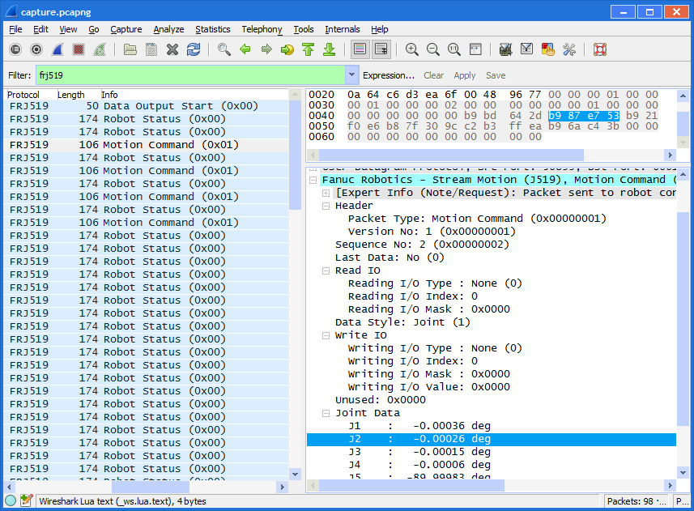

## packet-fanuc-stream-motion
v0.0.6

## Overview

This is a (rather quick-and-dirty) Wireshark Lua dissector for the Fanuc Stream Motion protocol.
For more information on the protocol, refer to the relevant Fanuc option documentation.

## Installation

### Linux

Copy or symlink the `packet-fanuc-stream-motion-j519.lua` file to either the Wireshark global (`/usr/(local/)share/wireshark/plugins`) or per-user (`$HOME/.config/wireshark/plugins` or `$HOME/.wireshark/plugins`) plugin directory.

### Windows

Copy or symlink the `packet-fanuc-stream-motion-j519.lua` file to either the Wireshark global (`%WIRESHARK%\plugins`) or per-user (`%APPDATA%\Wireshark\plugins`) plugin directory.

## Compatible Wireshark versions

The dissector has been extensively used with Wireshark versions 2.2.x, but is expected to work on most versions with Lua support.
